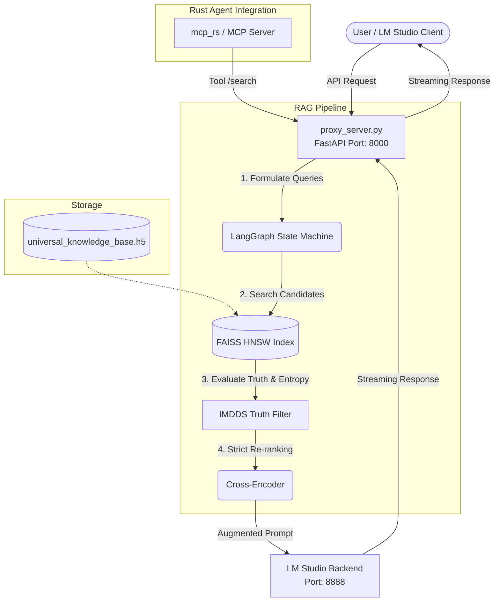
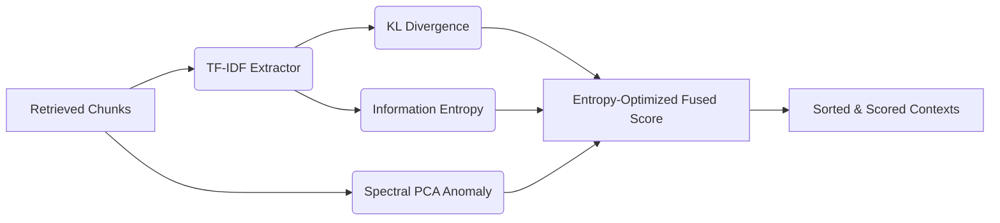

# LM Studio Hybrid Search Engine (OfflineRAG)

An advanced, completely local, privacy-first Retrieval-Augmented Generation (RAG) and search interceptor system for LM Studio. This project supercharges your local LLMs with hybrid semantic search, Cross-Encoder reranking, and an experimental Truth/Entropy Filter (IMDDS).

It serves as a "Hub" that intercepts LM Studio API calls, augments them with high-fidelity contextual data retrieved from your local document embeddings, and seamlessly streams the LLM's response back to the client.

## 🌟 Key Features

- **Local First & Privacy Resilient**: Zero data leaves your machine. Operates fully offline.
- **Advanced RAG Pipeline**: LangGraph-based RAG workflow evaluating if enough context has been retrieved.
- **Hybrid Search Engine**: Retrieves initial candidates explicitly using FAISS (HNSW) semantic search.
- **Cross-Encoder Re-Ranking**: Uses `ms-marco-MiniLM-L-6-v2` to strictly rank the chunks by true query relevance before presenting to the LLM.
- **IMDDS Truth Filter**: Advanced mathematical filtering using Bayesian posteriors, KL Divergences, and SVD to evaluate structural anomalies in text (penalizes deceptive/repetitive text and generates novel biomedical hypotheses).
- **Native MCP Support**: Includes a Rust-based Model Context Protocol (MCP) server for deep database retrieval via specialized agents.

## 🏗️ Architecture



## 🚀 Quick Start / Setup

### 1. Prerequisites
- Python 3.10+
- LM Studio (running locally on port `8888` with your preferred model)
- Your embedding model in `.gguf` format
- Required Python Packages (see below)

### 2. Installation
Clone the repository:
```bash
git clone https://github.com/Tim-Spurlin/LM-Studio-Hybrid-Search-Engine.git
cd LM-Studio-Hybrid-Search-Engine
```

Install dependencies:
```bash
python3 -m venv .venv
source .venv/bin/activate
pip install -r requirements.txt  # Ensure torch, faiss-cpu/gpu, sentence-transformers, fastapi, httpx, h5py are installed
```

### 3. Configuration
The system relies on a few environment variables that you can set or place in a `.env` file:

```shell
# LM Studio API Key (if you set one)
export LM_STUDIO_API_KEY="your_api_key_here"

# Path to your GGUF embedding model
export EMBED_MODEL_PATH="./models/llama-nemotron-embed-1b-v2-fixed.gguf"

# Where your HDF5 knowledge base will live
export HDF5_PATH="./universal_knowledge_base.h5"
export HNSW_INDEX_PATH="./faiss_hnsw.index"
```

### 4. Running the Server

Start the core proxy server:
```bash
python3 proxy_server.py
```
*The proxy will initialize the FAISS indexes, load the Cross-Encoder, and bind to `0.0.0.0:8000`.*

### 5. Point LM Studio Clients to the Proxy
In any application that connects to LM Studio (like a chat UI or agent), change the Base URL from `http://127.0.0.1:8888/v1` to `http://127.0.0.1:8000/v1`. 

The proxy will intercept the chat completions, run the RAG pipeline to pull context from your `HDF5` database, and then pass the augmented prompt back to LM Studio.

## 🧠 IMDDS Truth Filter
The **IMDDS (Information Metric & Deception Detection System)** is a unique layer that prevents AI hallucinations and evaluates information integrity BEFORE it reaches the LLM. 



## 🛡️ License
MIT License. Feel free to fork, adapt, and build powerful local AI search capabilities.
